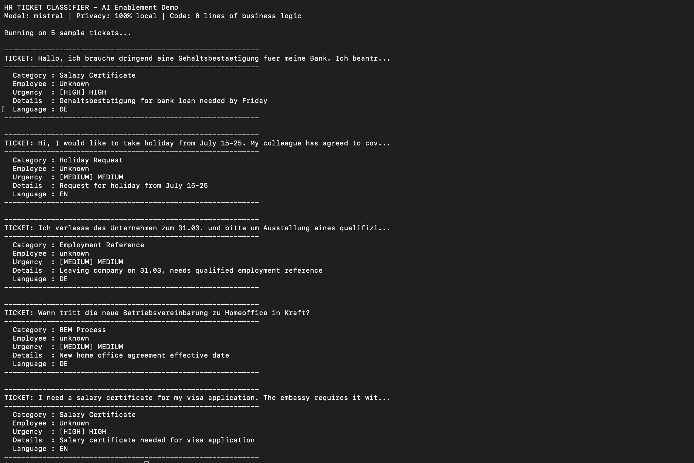

# 🤖 AI Enablement Toolkit

**No-code AI implementation guides, prompt templates, and workflow blueprints for internal business automation.**

Built by [Prateek Gaur](https://prateek-gaur-ml-bz0s69q.gamma.site) — AI Enablement Engineer | github.com/PRATdoppelEK

---


## What This Repository Is

This toolkit documents practical, no-code approaches to implementing AI inside organisations — specifically for HR, Operations, Finance, and Sales workflows. Every guide here is built around a real business problem and uses tools that require zero programming to configure.

> **Philosophy:** The best AI implementation is the one that solves a real problem, gets used by real people, and can be understood by non-technical colleagues. This toolkit prioritises simplicity, privacy, and measurable impact over technical complexity.

---

## 📁 Repository Structure

```
ai-enablement-toolkit/
│
├── docs/                          # Tool guides — how to use each platform
│   ├── make-com/                  # Make.com visual automation guides
│   ├── claude-projects/           # Claude.ai Projects setup guides
│   ├── n8n/                       # n8n self-hosted automation guides
│   └── copilot/                   # Microsoft Copilot configuration guides
│
├── workflows/                     # Ready-to-use workflow blueprints
│   ├── hr-ticket-classification/  # Auto-classify incoming HR requests
│   ├── meeting-summary/           # Automatic meeting note generation
│   ├── policy-qa/                 # Employee policy Q&A assistant
│   └── document-draft/            # AI-assisted document generation
│
├── prompts/                       # Versioned prompt library
│   ├── hr/                        # HR-specific prompts
│   ├── operations/                # Operations prompts
│   └── sales/                     # Sales prompts
│
└── demos/                         # Simple working demos
    ├── ticket-classifier/         # Local ticket classification demo
    └── policy-assistant/          # Claude Projects policy Q&A demo
```

---

## 🛠️ Tools Covered

| Tool | Use Case | Cost | Privacy |
|------|----------|------|---------|
| [Make.com](https://make.com) | Connect any app to any AI | Free tier available | Cloud — use for non-sensitive data |
| [n8n](https://n8n.io) | Same as Make.com, self-hosted | Free (self-hosted) | ✅ Fully local — GDPR safe |
| [Claude.ai Projects](https://claude.ai) | Instant RAG over documents | Claude subscription | Cloud — EU data option available |
| [Microsoft Copilot](https://copilot.microsoft.com) | AI inside Microsoft 365 | M365 licence | ✅ EU data centres |
| [Ollama](https://ollama.ai) | Run LLMs locally | Free | ✅ Fully local — GDPR safe |

---

## 🚀 Quick Start — Build Your First AI Tool in 20 Minutes

### Option A: Policy Q&A Assistant (Claude Projects — zero setup)
1. Go to [claude.ai](https://claude.ai) → **Projects** → **New Project**
2. Upload your internal policy documents (PDF or Word)
3. Add this system prompt to Project Instructions:
```
You are an HR assistant. Answer employee questions based ONLY on the 
uploaded documents. Always cite the specific document and section.
If the answer is not in the documents, say so clearly. Never guess.
```
4. Share the project link with your team. Done.

**Time required:** 20 minutes | **Code written:** 0 lines

---

### Option B: HR Ticket Auto-Classification (Make.com)
See full guide: [`workflows/hr-ticket-classification/`](workflows/hr-ticket-classification/)

**Time required:** 2-3 hours | **Code written:** 0 lines

---

## 📊 Use Cases Documented

| Use Case | Tool | Time Saved | Risk Level |
|----------|------|------------|------------|
| HR ticket classification | Make.com + Claude API | ~70% routing time | Low |
| Meeting summaries | MS Copilot / Make.com | 30-60 min/meeting | Very Low |
| Policy Q&A | Claude Projects | ~50% fewer HR queries | Low |
| Document draft generation | Claude Projects | ~80% drafting time | Low |
| Process bottleneck analysis | n8n + data export | Immediate visibility | Very Low |

---

## 🔒 Privacy & GDPR Principles

Every workflow in this toolkit is designed with data privacy as the default:

- **Sensitive HR data** → always use n8n (self-hosted) or Ollama (local). Never cloud APIs.
- **Non-sensitive data** → Make.com or Claude.ai with appropriate DPA agreements
- **Human approval required** for every consequential action (GDPR Article 22)
- **Full audit trail** — every AI call logged with timestamp, input category, and output
- **Prompt injection defence** — all document-processing workflows include explicit guardrails

---

## 📬 Contact

**Prateek Gaur** — AI Enablement Engineer  
📧 prateekgaur@gmx.de | 🌐 [Portfolio](https://prateek-gaur-ml-bz0s69q.gamma.site) | 🐙 [GitHub](https://github.com/PRATdoppelEK)

*See also: [`battery-digital-twin`](https://github.com/PRATdoppelEK/battery-digital-twin) · [`ai-copilot`](https://github.com/PRATdoppelEK/ai-copilot) · [`rag-engineering-docs`](https://github.com/PRATdoppelEK/rag-engineering-docs)*
